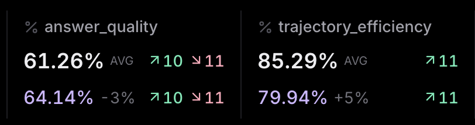
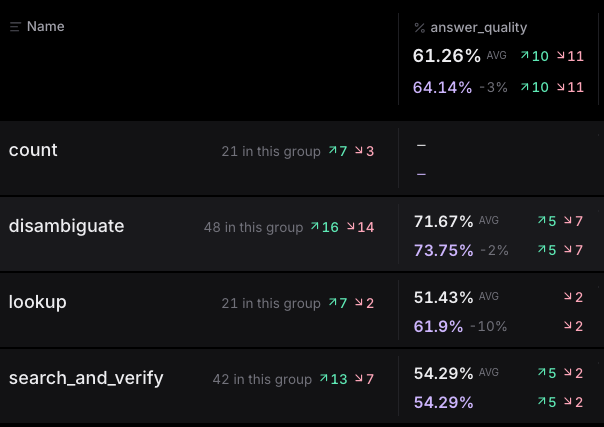
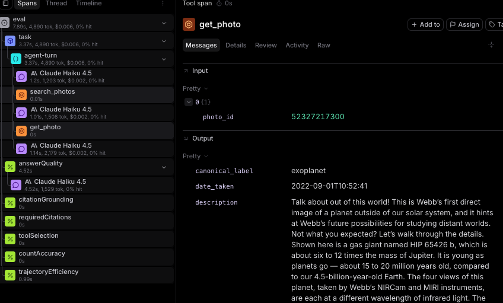

# JWST × Braintrust: a worked example of evaluating an AI agent

This is a working example of how Braintrust can help AI teams improve agent
engineering and products. It works through a scenario every team meets
eventually: an engineer edits a prompt inside an agent, and nobody can say
whether the agent actually got better.

In this project the agent answers questions about 979 James Webb Space Telescope
photos in a datastore, and then an evaluation (using Braintrust) decides whether
a change to it is safe to ship. Every number below came out of a real run, and
the screenshots are from my own Braintrust project.

<p align="center">
  
  <br>
  <sub><em>Photo 52439693830, the Pillars of Creation, taken 2022-10-19 &mdash; one of the 979 JWST images the agent answers questions about.</em></sub>
</p>

## The situation

A team wants an AI feature to be faster, less verbose, and cheaper. An engineer
rewrites the prompt, checks a few examples by hand, and the answers read better.
A colleague reviews the change, finds the new wording sensible, and approves it.
However, it is unknown what the change did to the cases nobody tried. Did the
agent actually get better?

To simulate this scenario, I wrote two prompts and used Braintrust to measure
the agent performance difference. The agent is designed to answer questions
about JWST images, such as finding a photo's ID, or "How many photos in the
corpus are labelled 'exoplanet'?" `v1-grounded` makes the agent open a photo's
full record before putting that photo's ID in an answer. `v2-concise` is the
edit someone would realistically make: be brief, trust what the search returned,
use fewer tool calls.

## What I found



White figures are `v2-concise`; the purple ones beneath are the `v1-grounded`
baseline.

Two checks moved. `trajectory_efficiency` went up, from 79.9% to 85.3%, because
the concise prompt made fewer tool calls, which is what it was asked to do.
`answer_quality` went down, from 64.1% to 61.3%. That is a drop of 2.9 points
against a hypothetical agreed limit of 5, so the gate passes and the change
ships. On this evidence it looks like a fair trade.

Then I grouped the same run by the kind of question being asked.



The header repeats the summary figure of −3%. Underneath it, almost all of the
loss sits in one group. `lookup` questions, which give the agent a photo ID and
ask what it shows, fell from 61.9% to 51.4%, more than triple the drop the
summary reported. `search_and_verify` did not move, holding at 54.3%, and
`count` questions are graded by a different check, which is why that row is
empty. Every question carries its type as a tag, so getting to this view was a
menu selection rather than analysis I had to write.

The trade is still a product decision, but now it is one somebody can make
against measured results instead of arguing about it in review. And when a
number looks wrong, it links back to the run that produced it:



## What the platform provided

Five things did work I would otherwise have had to build myself.

1. **Comparison against a baseline.** Every check reports how far it moved since
   the previous run, not just its score. That difference is what makes a rule
   like "quality may fall five points, but no further" enforceable; a single run
   leaves you with numbers and nothing to measure them against.

2. **Grouping by tag.** Every question carries its type as a tag, so the
   breakdown that produced the finding above was a menu selection rather than an
   analysis script.

3. **Scores that link to their run.** Clicking a low number opens the
   conversation that produced it, tool calls included. That is where the time
   goes when a result needs explaining.

4. **A pass or fail that CI can act on.** A bad change stops at the pull request
   rather than waiting for somebody to notice a dashboard.

5. **A model gateway.** The agent contains no provider-specific code, so running
   it on Claude instead of GPT is one line of configuration.

None of this would appear in application logs. The finding above exists because
one run was graded six separate ways, and because those results could then be
split by the type of question being asked.

This runs at demo scale: 44 questions, three trials, about a dollar. Three
things change at real scale. The questions come from production logs rather than
a generator, because live traffic fails in ways nobody thinks to write down. The
checks run against sampled production traffic, not only in CI, since the
regression that matters most is the one already shipped. And the limits stop
being mine to set, which is why they live in a reviewed file. What carries over
is the mechanism: one run, several independent checks, and results you can cut
by segment.

## The numbers

Each experiment ran 44 questions three times over, on Claude Haiku 4.5.

| Check | What it verifies | v1 | v2 | change |
|---|---|---|---|---|
| `trajectory_efficiency` | no wasted tool calls | 79.9% | 85.3% | +5.4 |
| `answer_quality` | prose correctness, graded by a model | 64.1% | 61.3% | −2.9 |
| `required_citations` | the answer names the right photo | 94.6% | 91.9% | −2.7 |
| `citation_grounding` | every cited ID came back from a tool call | 100% | 100% | — |
| `tool_selection` | the tools a question requires were used | 100% | 100% | — |
| `count_accuracy` | counts match exactly | 100% | 100% | — |

Five of the six are ordinary code, which keeps them quick and consistent, and I
used a model only for the one that needs judgement about prose. The limits live
in [one small file](evals/thresholds.json), so changing one is a decision
somebody signs off on rather than a number buried in the code.

Measured only against the questions built to require verification, the same
change breaches its limit:

```
  FAIL  answer_quality         52.5%  (-15.0)
  ok    trajectory_efficiency  72.8%   (+9.7)

  ✗ answer_quality: -15.0 exceeds its 5.0% limit
```

## Running it

Node 24 or later, a free [Braintrust](https://www.braintrust.dev) account, and
either an Anthropic or OpenAI key. A full comparison costs about a dollar.

```bash
git clone https://github.com/RK-A1/JWST-braintrust && cd JWST-braintrust
cp .env.example .env        # add your keys
npm install

npm run agent -- "How many nebula photos are in the corpus?"

PROMPT_VERSIONS=v1-grounded npx braintrust eval evals/   # baseline first
PROMPT_VERSIONS=v2-concise  npx braintrust eval evals/   # then the change
```

The photo data is committed and every image is a public URL, so it runs from a
fresh clone without a database or any downloads.

## What's in the repo

```
src/     the agent, its 3 tools, and the two prompt versions
evals/   6 checks, 44 generated questions, and the CI gate
data/    979 photos and the questions built from them
python/  the same evaluation written with the Python SDK
docs/    notes on moving from Langfuse to Braintrust
```

The agent and its evaluation are TypeScript, and `python/` holds the same
evaluation against the Python SDK, since showing a customer either one is a
matter of which they already use. Three files carry the argument:

| File | What it does |
|---|---|
| [`src/prompts.ts`](src/prompts.ts) | The two prompts. The only difference between the runs above. |
| [`evals/scorers.ts`](evals/scorers.ts) | The six checks, five in plain code and one calling a model. |
| [`evals/thresholds.json`](evals/thresholds.json) | The limits, and a note on why two checks deliberately have none. |

The photo categories come from matching Flickr tags against a rule list rather
than hand-labelling, so they are rough. Good enough to test whether the agent
retrieves the right record, but not a set I would call gold-standard. The
questions are generated from the photo data, so they cannot drift out of sync.

An earlier project of mine instrumented a vision model on this same photo
corpus using Langfuse; [the migration notes](docs/migrating-from-langfuse.md)
compare the two platforms.
